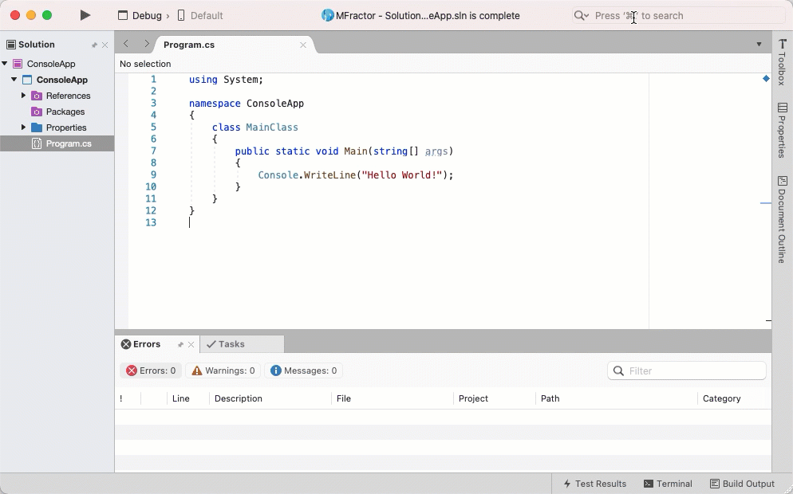

# FastGuid
Quickly create new GUIDs and copy them to your clipboard in Visual Studio Macs.

## Creating A Guid

FastGuid integrates into Visual Studio Macs global search bar and is accesible by typing `Create Guid`.

To create a new guid:

 1. Press `Command` + `.` to focus the search bar
 2. Type `Create Guid`.
 3. Press enter.

The new GUID will be copied to your clipboard.

As the search bar supports partial search matching, you can also enter the `cg` or `guid` to activate the **Create Guid** command.

## Creating Multiple GUIDs

To create multiple GUIDs at once: add a `:` after the command and then enter the amount of GUIDs to create. 

For example:

 * `Create Guid:12` would create 12 guids and copy them to the clipboard, separated by newlines.
 * `guid:4` would create 4 guids and copy them to the clipboard, separated by newlines.
 * `cg:10` would create 10 guids and copy them to the clipboard, separated by newlines.

## Installation

To install FastGuid:

 1. Download the latest mpack from the [Releases page](https://github.com/matthewrdev/VSMac.FastGuid/releases).
 2. Open Visual Studio for Mac.
 3. Under the top **Visual Studio** menu bar, select **Extensions...**
 4. Select **Install From File**
 5. Browse to the downloaded FastGuid mpack and select it.
 6. After installation, restart Visual Studio Mac.
